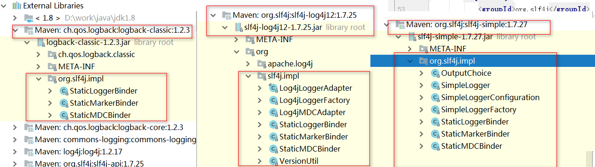

# 项目说明
***项目目录结构：***

- log4j
	使用commons-logging作为日志接口，优先选择log4j作为日志实现，
	如果没有引入log4j使用JDK logging 作为日志实现。
	
	
	
- logback

  使用slf4j作为日志接口，使用哦logback作为日志实现

# 日志接口

## commons-logging

默认情况下，Commons Loggin自动搜索并使用Log4j（Log4j是另一个流行的日志系统），如果没有找到Log4j，再使用JDK Logging。

1、日志调用

a、引入依赖

```properties
<dependency>
   <groupId>commons-logging</groupId>
   <artifactId>commons-logging</artifactId>
   <version>1.2</version>
</dependency>
```

b、日志调用

```java
import org.apache.commons.logging.Log;
import org.apache.commons.logging.LogFactory;

public class Main {
	public static void main(String[] args) {
		Log logger = LogFactory.getLog(Main.class);
		logger.error("error");
		logger.warn("warn");
		logger.info("info");
		logger.debug("debug");
	}
}
```

2、log4j实现

[详细配置](https://blog.csdn.net/azheng270/article/details/2173430?utm_medium=distribute.pc_relevant.none-task-blog-BlogCommendFromMachineLearnPai2-2.nonecase&depth_1-utm_source=distribute.pc_relevant.none-task-blog-BlogCommendFromMachineLearnPai2-2.nonecase)

a、引入log4jj依赖

```xml
<dependency>
   <groupId>log4j</groupId>
   <artifactId>log4j</artifactId>
   <version>1.2.17</version>
</dependency>
```

b、配置log4j

```properties
### set log levels ###
log4j.rootLogger = debug,stdout,D,E

### 输出到控制台 ###
log4j.appender.stdout = org.apache.log4j.ConsoleAppender
log4j.appender.stdout.Target = System.out
log4j.appender.stdout.layout = org.apache.log4j.PatternLayout
log4j.appender.stdout.layout.ConversionPattern =  %d{ABSOLUTE} %5p %c{1}:%L - %m%n

### 输出到日志文件 ###
log4j.appender.D = org.apache.log4j.DailyRollingFileAppender
log4j.appender.D.File = logs/log.log
log4j.appender.D.Append = true
log4j.appender.D.Threshold = debug 
log4j.appender.D.layout = org.apache.log4j.PatternLayout
log4j.appender.D.layout.ConversionPattern = %-d{yyyy-MM-dd HH:mm:ss}  [ %t:%r ] - [ %p ]  %m%n

### 保存异常信息到单独文件 ###
log4j.appender.E = org.apache.log4j.DailyRollingFileAppender
log4j.appender.E.File = logs/error.log
log4j.appender.E.Append = true
log4j.appender.E.Threshold = error 
log4j.appender.E.layout = org.apache.log4j.PatternLayout
log4j.appender.E.layout.ConversionPattern = %-d{yyyy-MM-dd HH:mm:ss}  [ %t:%r ] - [ %p ]  %m%n
```

3、jdk-logging

[logging深入分析](https://my.oschina.net/xianggao/blog/520776)

a、引入依赖

无需引入

b、配置logging

默认配置路径：$JAVA_HOME/jre/lib/logging.properties

自定义配置：-Djava.util.logging.config.file=logging.properties

## slf4j

slf4j的直接实现是logback，如果要使用log4j实现需要引入slf4j-log4j作为中转

> [logback详细使用](https://juejin.im/post/5b51f85c5188251af91a7525)

1、依赖

```xml
<dependency>
   <groupId>ch.qos.logback</groupId>
   <artifactId>logback-classic</artifactId>
   <version>1.2.3</version>
</dependency>
```

2、配置

```xml
<?xml version="1.0" encoding="UTF-8"?>
<configuration>
   <appender name="STDOUT"
           class="ch.qos.logback.core.ConsoleAppender">
      <encoder class="ch.qos.logback.classic.encoder.PatternLayoutEncoder">
         <Pattern>%d{HH:mm:ss.SSS} %-5level %logger{80} - %msg%n</Pattern>
      </encoder>
   </appender>

   <appender name="rollFile"
           class="ch.qos.logback.core.rolling.RollingFileAppender">
      <append>true</append>
      <filter class="ch.qos.logback.classic.filter.ThresholdFilter">
         <level>debug</level>
      </filter>
      <file>
         dir_logback/log.log
      </file>
      <rollingPolicy class="ch.qos.logback.core.rolling.TimeBasedRollingPolicy">
         <FileNamePattern>dir_logback/log.log.%d{yyyy-MM-dd}</FileNamePattern>
         <MaxHistory>30</MaxHistory>
      </rollingPolicy>
      <encoder class="ch.qos.logback.classic.encoder.PatternLayoutEncoder">
         <pattern>%d{yyyy-MM-dd HH:mm:ss.SSS} [%thread] %-5level %logger{50} - %msg%n</pattern>
         <charset>UTF-8</charset>
      </encoder>
   </appender>

   <root level="debug">
      <appender-ref ref="rollFile"/>
      <appender-ref ref="STDOUT"/>
   </root>
</configuration>
```

# 日志实现替换



切换日志实现（slf4j-*）


# 统一日志框架

> 示例可以查看logback模块（使用slf4j+logback日志框架），其中引用log4j模块（使用commons-logging+log4j日志框架），所以使用jcl-over-slf4j替代commons-logging，使用log4j-over-slf4j替代log4j，最终日志使用logback模块日志框架

应用中可能引入各个组件，而各组件中日志框架可能不一样，所以需要统一日志框架。

使用jcl-over-slf4j.jar 替换common-logging 日志接口，使用log4j-over-slf4j jul-to-slf4j替换日志实现


